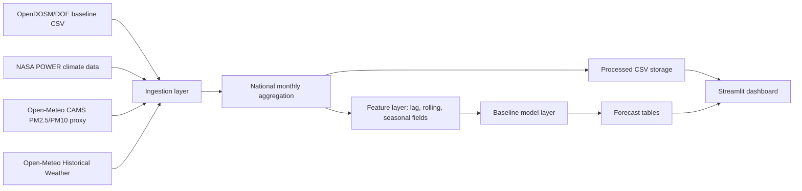

# Malaysia Air Quality and Climate Dashboard

Streamlit data product for the P2 project. The app is designed around national Malaysia aggregation first, with official OpenDOSM/DOE data as baseline context and 2023-2026 analysis supported by clearly labelled public modelled, reanalysis, and proxy datasets.

## Product Choice

Recommended option: **Streamlit application**.

It gives the best balance for this FYP stage: stronger examiner demonstration than a static report, lower implementation burden than Flask/FastAPI plus a custom frontend, and easier deployment than Power BI licensing or a custom cloud stack.

## Data Sources

- Official baseline: OpenDOSM/DOE monthly air pollution data, 2017-01 to 2022-12, `https://storage.data.gov.my/environment/air_pollution.csv`
- Recent PM proxy: Open-Meteo Air Quality API using CAMS global modelled PM estimates, 2022-08 to 2026-06, `https://open-meteo.com/en/docs/air-quality-api`
- Climate context: NASA POWER monthly climate data, 2023-01 to 2025-12, `https://power.larc.nasa.gov/docs/services/api/temporal/monthly/`
- Recent weather context: Open-Meteo Historical Weather, 2026-01 to 2026-06, `https://open-meteo.com/en/docs/historical-weather-api`

## Local Setup

```bash
python -m venv .venv
source .venv/bin/activate
pip install -r requirements.txt
```

## Run Pipeline

Process existing local files only:

```bash
python scripts/run_pipeline.py
```

Download public OpenDOSM and NASA POWER files first, then process:

```bash
python scripts/run_pipeline.py --download-public
```

## Run Dashboard

```bash
streamlit run app/streamlit_app.py
```

## Streamlit Community Cloud

Suggested app URL:

```text
22108471-mds-p2-malaysia-air-climate-dashboard.streamlit.app
```

Streamlit app entrypoint:

```text
app/streamlit_app.py
```

The requested underscore version is not suitable as a public hostname because app subdomains should use DNS-safe characters. Use hyphens for the deploy URL.

## Outputs for P2

- `data/processed/integrated_environment_monthly.csv`: integrated national monthly dataset
- `data/processed/monthly_features.csv`: lag, rolling, and seasonality features
- `reports/tables/data_coverage_summary.csv`: Chapter 4 data coverage table
- `reports/tables/forecast_results.csv`: Chapter 4 forecast output

## Architecture


